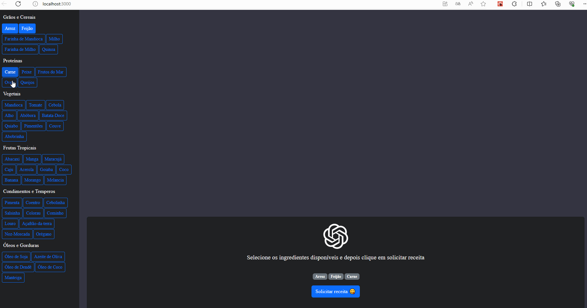

# ChatGPT Integration

Bem-vindo ao repositório ChatGPT Integration! Este projeto é uma Single Page Application (SPA) construída com ReactJS, projetada para interagir com o poderoso algoritmo GPT-3.5-turbo-0613 da OpenAI. A aplicação proporciona uma experiência prática, apresentando um menu lateral com os principais ingredientes da culinária brasileira. Os usuários podem selecionar ingredientes de sua escolha, e a aplicação interage com uma API Node.js para enviar prompts ao GPT-3.5-turbo-0613.

## Descrição do Projeto

O propósito principal desta aplicação é gerar receitas caseiras personalizadas com base nos ingredientes selecionados, fazendo uso da avançada capacidade de geração de linguagem natural da OpenAI. A abordagem adotada visa oferecer uma ferramenta útil para os entusiastas da culinária, fornecendo sugestões criativas e adaptadas aos ingredientes disponíveis.

A integração eficiente do ReactJS proporciona uma experiência de usuário suave e responsiva, enquanto a API Node.js gerencia a comunicação efetiva com o GPT-3.5-turbo-0613. Este projeto destaca como a OpenAI pode ser aplicada para criar ferramentas inovadoras, agregando valor ao dia a dia e explorando o potencial da inteligência artificial para melhorar a qualidade de vida.

## Demo


## Instruções de Inicialização do Projeto

### Projeto Back-end

1. Acesse a pasta do servidor:
   ```bash
   cd server
   ```

2. Instale os pacotes Node.js:
   ```bash
   npm i
   ```

3. Inicie o servidor:
   ```bash
   npm start
   ```

### Projeto Front-end

1. Acesse a pasta do front-end:
   ```bash
   cd web
   ```

2. Instale os pacotes Node.js:
   ```bash
   npm i
   ```

3. Inicie o projeto web:
   ```bash
   npm start
   ```

Agora você está pronto para explorar e interagir com a aplicação ChatGPT Integration!

## Contribuições

Contribuições são bem-vindas! Se você encontrar bugs, tiver sugestões de melhorias ou desejar adicionar novos recursos, sinta-se à vontade para abrir uma issue ou enviar um pull request.

## Licença

Este projeto é licenciado sob a Licença MIT - consulte o arquivo [LICENSE](LICENSE) para obter detalhes.

Esperamos que este repositório seja útil e inspire novas e emocionantes aplicações com o ChatGPT!